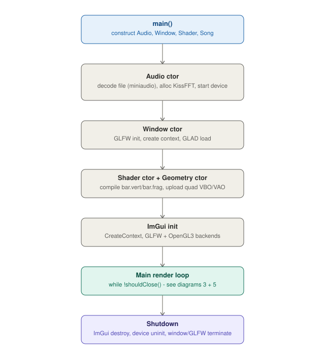
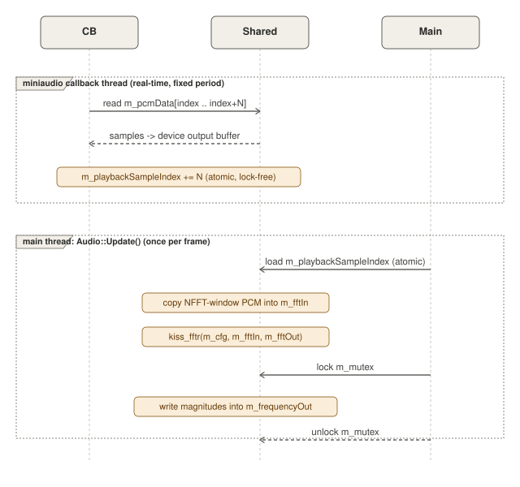
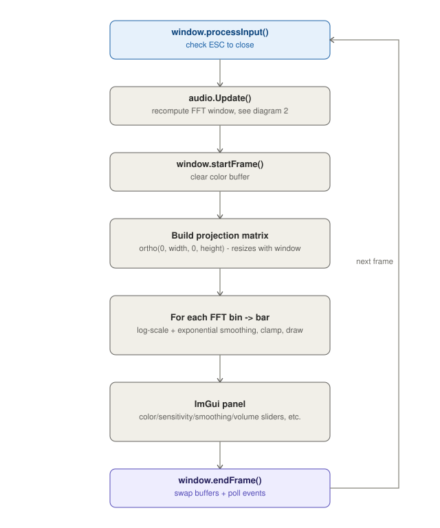
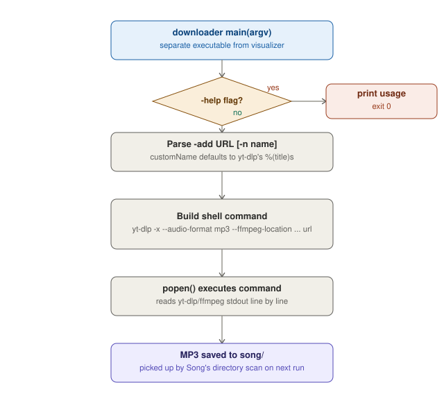
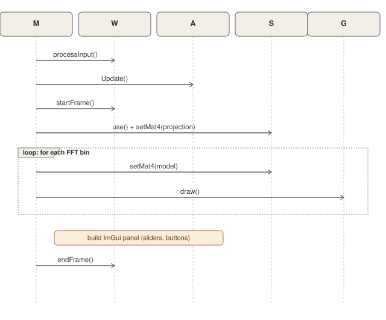

# 🎵 C++ Music Visualizer

A real-time, synchronized audio visualizer built from scratch using C++ and
OpenGL. Decodes an audio file, runs a live FFT on the currently-playing
samples, and renders a frequency spectrum as animated 2D bars — with an
ImGui control panel for tweaking color, sensitivity, smoothing, and volume
on the fly.

## 📝 Description

This project renders a frequency spectrum analysis of audio files. Audio
is decoded and played back through [miniaudio](https://miniaud.io/), while
[kissfft](https://github.com/mborgerding/kissfft) converts the currently
playing window of samples into frequency magnitudes each frame, which are
then rendered as 2D bars using custom OpenGL shaders.

A separate `downloader` tool (bundled in the same build) can pull the
audio track straight from a YouTube URL via `yt-dlp` + `ffmpeg`.

The core goal of this project is to make a visualizer for my favorite songs.

## Table of Contents

- [Description](#description)
- [Tech Stack](#tech-stack)
- [Roadmap](#roadmap)
- [Architecture](#architecture)
- [Project Structure](#project-structure)
- [Build](#build)
- [Usage](#usage)
  - [Visualizer](#visualizer)
  - [Downloader](#downloader)
- [Design Notes](#design-notes)
- [Benchmark](#benchmark)
  - [CPU Time Profile](#cpu-time-profile)
  - [CPU Cycle Profile](#cpu-cycle-profile)
  - [Branch Prediction and Prefetcher Profile](#branch-prediction-and-prefetcher-profile)
  - [CPU Cache Misses](#cpu-cache-misses)
  - [Memory Load and Store Activity](#memory-load-and-store-activity)
  - [Virtual Memory Activity](#virtual-memory-activity)
- [Known Issues](#known-issues)
- [Future Work](#future-work)

## 🛠️ Tech Stack

* **Language:** C++17
* **Graphics:** OpenGL (loaded via [GLAD](https://glad.dav1d.de/))
* **Windowing:** [GLFW](https://www.glfw.org/)
* **UI:** [Dear ImGui](https://github.com/ocornut/imgui)
* **Math:** [GLM](https://github.com/g-truc/glm)
* **Audio:** [miniaudio](https://miniaud.io/) (playback & decoding, header-only)
* **Analysis:** [kissfft](https://github.com/mborgerding/kissfft) (frequency transformation)
* **Media Downloader:** [yt-dlp](https://github.com/yt-dlp/yt-dlp) (video/audio extraction)
* **Media Processing:** [ffmpeg](https://ffmpeg.org) (audio format conversion)

## 🗺️ Roadmap

The current focus is evolving the project from a static visualizer into an
interactive application using **Dear ImGui**.

- [ ] **Level 6: Playback Control (The Jukebox)**
    - Implement a "Load-All" playlist system.
    - **Playlist:** Allow switching between different loaded audio files.
      `Song` currently only scans the `song/` folder into a filename list —
      `loadAudio()`, `nextSong()`, and `prevSong()` are declared but not
      yet implemented or wired into `main.cpp`.

- [ ] **Level 7: Add and Remove Song functionality**
    - Remove song using the mp3 file name (unchanged if the song doesn't exist)

- [ ] Spacebar to pause/resume the song
- [ ] Audio file cache (optional)

---

## Architecture

Split into five smaller diagrams instead of one wide canvas, so each stays
readable at normal README width.

### 1. High-level startup and shutdown flow

What `main()` constructs, in order, before entering the render loop, and
how it tears everything down on exit.



### 2. Dual-thread audio pipeline

The most interesting piece of this project's design: the `miniaudio`
playback callback and the main thread's FFT computation run concurrently
and share state through an atomic index and a mutex, with no locking on
the real-time audio thread's hot path.



### 3. Per-frame render loop

What happens every iteration of the main loop, from input polling through
presenting the frame.



### 4. Downloader CLI tool

The second, independent executable built by the same `CMakeLists.txt`,
which shells out to bundled `yt-dlp`/`ffmpeg` binaries to fetch a song.



### 5. Per-frame sequence across objects

The same render loop as section 3, shown as a sequence diagram — makes it
explicit which object (`Window`, `Audio`, `Shader`, `Geometry`) owns each
call.



## Project Structure

```
MusicVisualizer/
├── CMakeLists.txt
├── include/
│   ├── audio.h
│   ├── geometry.h
│   ├── shader.h
│   ├── song.h
│   ├── window.h
│   └── stb_image.h        # bundled, currently unused by any .cpp
├── lib/
│   └── miniaudio.h        # header-only audio playback/decoding
├── shader/
│   ├── bar.vert
│   └── bar.frag
├── song/                  # audio files live here (scanned by Song, populated by downloader)
├── src/
│   ├── main.cpp
│   ├── audio.cpp
│   ├── downloader.cpp     # builds the separate `downloader` executable
│   ├── geometry.cpp
│   ├── shader.cpp
│   ├── song.cpp
│   └── window.cpp
└── third_party/
    ├── glad/               # OpenGL function loader
    ├── imgui/              # UI library (core + GLFW/OpenGL3 backends)
    ├── kiss_fft/            # FFT library, built as a static lib
    └── bin/                 # bundled yt-dlp / ffmpeg binaries
```

| File | Responsibility |
|---|---|
| `main.cpp` | Owns the window/audio/shader/geometry objects, runs the per-frame loop and ImGui panel |
| `audio.{h,cpp}` | Decodes the file via miniaudio, drives playback through a device callback, and computes the live FFT each frame |
| `window.{h,cpp}` | GLFW window/context lifecycle, input polling, fullscreen toggle, frame begin/end |
| `shader.{h,cpp}` | Compiles/links GLSL shaders, sets uniforms (`mat2`–`mat4`, vectors, scalars) |
| `geometry.{h,cpp}` | Owns the VAO/VBO for the shared unit-quad bar mesh |
| `song.{h,cpp}` | Scans a folder into a playlist filename list — see Roadmap for what's not yet implemented |
| `downloader.cpp` | Standalone CLI tool: `yt-dlp`/`ffmpeg` wrapper that extracts MP3s into `song/` |
| `lib/miniaudio.h` | Third-party, header-only; single-file audio I/O and decoding across platforms |
| `third_party/` | GLAD, Dear ImGui, kissfft (built as a static lib), and bundled `yt-dlp`/`ffmpeg` binaries |

## Build

### Prerequisites
A C++17 compiler (GCC/Clang/MSVC) and CMake 3.25 or newer. `glfw3` and
`glm` are resolved via `find_package(... CONFIG REQUIRED)`, so they need to
be available to CMake first (e.g. via vcpkg, Homebrew, or your system
package manager).

Run the setup script for your platform to install the required libraries
automatically. A compiler and the required system tools are assumed to be
already installed.

**Mac / Linux:**
```bash
chmod +x setup_unix.sh
./setup_unix.sh
```
Detects macOS (Homebrew), Debian/Ubuntu (`apt`), Arch (`pacman`), or
Fedora (`dnf`) and installs `cmake`, `glfw`, and `glm` accordingly.

**Windows** (downloads the media tools and installs libraries via vcpkg):

```powershell
powershell -ExecutionPolicy Bypass -File .\setup_win.ps1
```
This downloads native Windows copies of `yt-dlp.exe` and `ffmpeg.exe` into
`third_party/bin/`, then bootstraps `vcpkg` and installs `glfw3` and `glm`.
Configure CMake with vcpkg's toolchain file:
```powershell
cmake -S . -B build `
  -DCMAKE_TOOLCHAIN_FILE=".\vcpkg\scripts\buildsystems\vcpkg.cmake"
cmake --build build
```

### Build Instructions

```bash
# 1. Clone the repository
git clone https://github.com/ReiSirose/MusicVisualizer.git
cd MusicVisualizer

# 2. Create build directory
mkdir build
cd build

# 3. Configure and build (macOS/Linux)
cmake ..
cmake --build .

# 4. Run the visualizer (macOS/Linux)
./visualizer
```

On Windows, run the executables from PowerShell:

```powershell
.\build\visualizer.exe
.\build\downloader.exe -add "<youtube-url>"
```

This produces two executables: `visualizer` (the main app) and
`downloader` (the YouTube-to-MP3 tool) — see Usage below.

## Usage

### Visualizer

```bash
./visualizer
```

Currently loads a hardcoded track (`song/flower_thief.mp3`, set via
`SONG_PATH` in `main.cpp`) — see the Roadmap for the planned playlist
picker.

Runtime controls, via the ImGui panel:
- **Bar Color** — color picker for the spectrum bars
- **Height Scale** — sensitivity multiplier applied to the FFT magnitudes
- **Smoothing** — exponential smoothing factor between frames
- **SongSlider** — scrub to a position in the track
- **Volume** — playback volume
- **Fullscreen** — toggle fullscreen
- **Play/Pause button** — start/stop playback

### Downloader

```bash
./downloader -add <youtube-url> [-n <custom-name>]
./downloader -help
```

Extracts the audio as MP3 into `song/`, named from the video title unless
`-n` is given. The paths to `yt-dlp` and `ffmpeg` are configured at build
time. On Windows, run `setup_win.ps1` first to download the native binaries
into `third_party/bin/`.

## Design Notes

- **Real-time audio thread stays lock-free on its hot path.** The
  `miniaudio` device callback only reads `m_pcmData` and increments
  `m_playbackSampleIndex` — both handled with `std::atomic`, no mutex — so
  audio playback can't be blocked or glitch waiting on the render thread.
- **FFT runs on the main thread, not the audio thread.** `Audio::Update()`
  reads the atomic playback index once per frame, copies an `NFFT`-sample
  window into `m_fftIn`, and runs `kiss_fftr`. Only the final write into
  `m_frequencyOut` (read by the render loop) is protected by
  `std::mutex m_mutex`, keeping the critical section as small as possible.
- **Bar heights are log-scaled and smoothed, not raw magnitudes** —
  `log10(1 + magnitude) * sensitivity`, then exponentially smoothed toward
  the previous frame's height (`smoothFactor`), which is why the bars
  animate rather than snap.
- **`downloader` is a fully separate executable**, not a mode of
  `visualizer` — it shares the CMake project but has no dependency on
  OpenGL/GLFW/ImGui, only `<filesystem>` and `popen`/`_popen` to shell out
  to `yt-dlp`.

<!-- TODO: note here once decided — should downloaded tracks auto-refresh
     the in-app playlist, or does the user need to restart visualizer? -->

## Benchmark

The following baseline was captured with Xcode Instruments while running the
visualizer on macOS. The profile is intended to identify where optimization
work will have the greatest impact; results will vary with the audio file,
window size, hardware, and build configuration.

The CPU bottleneck breakdown was 27.08% useful, 23.50% instruction
processing, 44.77% instruction delivery, and 4.82% discarded, across
7,526,891,024 cycles. The function-level percentages below come from an
inclusive call tree, so nested rows overlap and should not be added together.

### CPU Time Profile

The profiled process used 616.57 ms of CPU time in total:

| Area | CPU time | Share |
|---|---:|---:|
| `Audio::Audio()` | 274.39 ms | 44.5% |
| `ma_decoder_read_pcm_frames` | 262.45 ms | 42.6% |
| `Window::endFrame()` | 205.63 ms | 33.4% |
| `swapBuffersNSGL` | 191.16 ms | 31.0% |
| `Geometry::draw()` | 32.50 ms | 5.3% |
| `Window::Window()` | 20.84 ms | 3.4% |

Audio decoding during startup is the dominant measured application cost,
while presenting frames through `swapBuffersNSGL` is the largest rendering
cost.

### CPU Cycle Profile

The process used 6.65 billion CPU cycles. Audio initialization and decoding
accounted for most of the measured cycles:

| Area | Cycles | Share |
|---|---:|---:|
| `Audio::Audio()` | 5.15 G | 77.4% |
| `ma_decoder_read_pcm_frames` | 5.00 G | 75.2% |
| `Geometry::draw()` | 350.70 M | 5.3% |
| `Window::endFrame()` | 179.60 M | 2.7% |
| `Window::Window()` | 137.90 M | 2.1% |

### Branch Prediction and Prefetcher Profile

| Instrument counter | Count |
|---|---:|
| Unpredicted memory dependencies | 36,359,147 |
| Incorrectly predicted other branches | 1,365,966 |
| Incorrectly predicted conditional branches | 12,577,434 |
| Incorrectly predicted branches | 13,943,400 |
| Taken branches | 1,576,862,302 |
| Branches | 2,032,775,147 |
| SIMD vector arithmetic operations | 74,355,920 |
| Cycles in this sample | 7,210,830,054 |

### CPU Cache Misses

| Instrument counter | Count |
|---|---:|
| L1 data TLB misses | 12,367,582 |
| L1 data-cache store misses | 36,856,710 |
| L1 data-cache load misses | 34,870,904 |
| Cycles in this sample | 7,062,740,533 |

### Memory Load and Store Activity

| Instrument counter | Count |
|---|---:|
| Accesses crossing 64-byte cache lines (speculative) | 46,932,617 |
| Accesses crossing pages (speculative) | 32,201 |
| Non-temporal loads (speculative) | 38,952,822 |
| Non-temporal stores (speculative) | 18,175,527 |
| Cycles in this sample | 7,791,238,309 |

### Virtual Memory Activity

| Instrument counter | Count |
|---|---:|
| L1D TLB accesses (speculative) | 11,009,366,959 |
| L1D TLB fills (speculative) | 6,932,958 |
| L1D TLB misses (speculative) | 26,781,955 |
| L2 TLB misses (speculative) | 2,560,560 |
| MMU data access walks (speculative) | 2,791,103 |
| Cycles in this sample | 7,139,342,671 |

The branch-misprediction rate was 13,943,400 out of 2,032,775,147 recorded
branches, or approximately 0.69%. Instruments showed a noticeable
branch-misprediction spike between three and four seconds of runtime. L1
data-cache load misses also spiked by approximately three million during
that interval, then followed a roughly 50 ms repeating pattern.

These results make audio decoding the first area to investigate, followed by
frame presentation and the repeating runtime cache pattern.

## Known Issues

- `Song::loadAudio()`, `nextSong()`, and `prevSong()` are declared in
  `song.h` but have no implementation in `song.cpp` — `Song` currently
  only scans filenames into `m_playList` in its constructor.
- `main.cpp` hardcodes the song path/name (`SONG_PATH`, `SONG_NAME`)
  rather than using the `Song` playlist it constructs.
- The URL should also be quoted because YouTube URLs may contain `&`, which has special meaning to the shell. The command construction and working-directory assumptions still need attention for a fully reliable Windows downloader.

## Future Work

<!-- TODO -->
- [ ] Wire up `Song`'s playlist so `visualizer` can switch tracks at runtime
- [ ] Playlist UI in ImGui (song list, next/prev/remove)
- [ ] Auto-refresh the playlist after `downloader` adds a new track
- [ ] Persist user settings (color, sensitivity, smoothing, volume) between runs